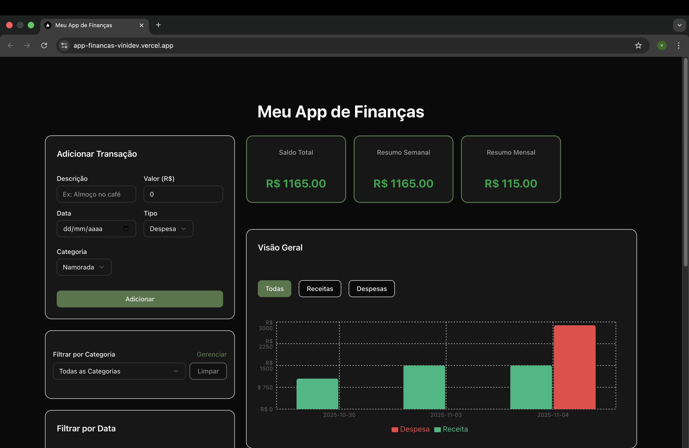

# 💰 Controle de Finanças Pessoais (Full-Stack)

Este é um aplicativo Full-Stack completo para controle financeiro pessoal, construído do zero. A aplicação permite aos usuários cadastrar e gerenciar transações (receitas e despesas), atribuí-las a categorias, e visualizar um dashboard dinâmico com resumos financeiros e gráficos.

O projeto foi desenvolvido com foco em boas práticas de arquitetura de software, separação de responsabilidades (Frontend, Backend, DB) e um deploy de nível profissional usando Docker, AWS e Vercel.

## 📸 Aplicação em Funcionamento (Tema Escuro)

> ### Clique no print abaixo para ver o vídeo da aplicação:
>
> [](https://www.youtube.com/watch?v=qQKq-TrPQ7w)


## 📊 Funcionalidades (Features)

- **CRUD de Transações**: Criação, leitura, edição e exclusão de receitas e despesas.
- **CRUD de Categorias**: Gerenciamento completo de categorias (criar, editar, excluir) com edição inline.
- **Dashboard Dinâmico**: Resumos em tempo real do Saldo Total, Resumo Semanal e Resumo Mensal.
- **Gráfico Interativo**: Gráfico de barras (com recharts) que mostra o fluxo de caixa (Receita vs. Despesa) por dia.
- **Filtragem Combinada**: Filtre transações por Tipo (Receita/Despesa), Categoria e Intervalo de Datas.
- **UI Moderna**: Interface construída com shadcn/ui, Tailwind CSS e um tema escuro permanente.
- **Notificações (Toasts)**: Feedback visual (com sonner) para todas as ações do usuário (criar, editar, deletar).

## 🛠️ Stack de Tecnologias

Este projeto utiliza uma arquitetura de microsserviços desacoplada.

### Frontend

- **Framework**: Next.js 14+ (com App Router)
- **Linguagem**: TypeScript
- **UI**: React, Tailwind CSS
- **Biblioteca de Componentes**: shadcn/ui
- **Gráficos**: recharts
- **Notificações**: sonner

### Backend

- **Framework**: Spring Boot 3+
- **Linguagem**: Java 21
- **Acesso a Dados**: Spring Data JPA / Hibernate
- **Migrações**: Flyway
- **Mapeamento**: MapStruct

### Banco de Dados & Infraestrutura

- **Banco de Dados**: PostgreSQL (rodando em um container Docker)
- **Containerização**: Docker & Docker Compose
- **Deploy (Backend)**: AWS EC2 (Amazon Linux t3.micro)
- **Deploy (Frontend)**: Vercel
- **Rede (SSL/CORS)**: Caddy Reverse Proxy com DuckDNS (para domínio e HTTPS gratuitos)
- **Registry de Imagens**: Docker Hub

## 🚀 Arquitetura de Deploy (Produção)

O deploy foi desenhado para performance e escalabilidade, separando o Frontend (servido estaticamente na Vercel) do Backend (servidor de API, na EC2). 

## ⚡ Como Rodar (Desenvolvimento Local)

Para rodar este projeto na sua máquina local, você precisará ter o **Java 21 (JDK)**, **Node.js** e **Docker** instalados.

### 1. Clone o Repositório

```bash
git clone https://github.com/SEU_USUARIO/financas-pessoais.git
cd financas-pessoais
```

### 2. Configure as Variáveis de Ambiente

Crie um arquivo chamado `.env` na raiz do projeto, copiando o `.env.example`.

```bash
# Conteúdo para o .env (na raiz)

# Credenciais do Banco
POSTGRES_DB=finance
POSTGRES_USER=user
POSTGRES_PASSWORD=password

# Porta que o Backend vai rodar (para o Caddy do Docker e o IntelliJ)
SERVER_PORT=8081

# URLs de Conexão com o Banco
# (Usada pelo Spring Boot quando roda DENTRO do Docker)
SPRING_DATASOURCE_URL_DOCKER=jdbc:postgresql://postgres_db:5432/finance
# (Usada pelo Spring Boot quando roda FORA do Docker, ex: IntelliJ)
SPRING_DATASOURCE_URL=jdbc:postgresql://localhost:5432/finance
SPRING_DATASOURCE_USERNAME=user
SPRING_DATASOURCE_PASSWORD=password
```

### 3. Inicie o Banco de Dados (Docker)

Este é o único container necessário para o dev local:

```bash
docker-compose up -d postgres_db
```

### 4. Inicie o Backend (IntelliJ/VS Code)

1. Abra a pasta `backend/Finance` no seu IDE Java.
2. Configure as Variáveis de Ambiente no seu "Run Configuration" (o IntelliJ **NÃO** lê o `.env` automaticamente):
   - `SERVER_PORT=8081`
   - `SPRING_DATASOURCE_URL=jdbc:postgresql://localhost:5432/finance`
   - `SPRING_DATASOURCE_USERNAME=user`
   - `SPRING_DATASOURCE_PASSWORD=password`
3. Rode a classe principal `FinanceApplication.java`.
4. O Flyway irá criar as tabelas automaticamente no banco Docker.

### 5. Inicie o Frontend (Terminal)

Em um novo terminal, navegue para a pasta `frontend/`:

```bash
cd frontend
npm install
npm run dev
```

### 6. Acesse o App

Abra [http://localhost:3000](http://localhost:3000) no seu navegador.

## ☁️ Como Rodar (Deploy na AWS - Visão Geral)

Instruções de alto nível para o deploy híbrido Vercel/AWS:

### 1. Build e Push (Localmente)

```bash
# 1. Compilar o .jar do Backend
cd backend && cd Finance && ./mvnw clean package -DskipTests && cd .. & cd.. 

# 2. Construir as imagens do Backend e Frontend
docker-compose build

# 3. Enviar as imagens para o Docker Hub
docker-compose push
```

### 2. Configuração do Servidor (AWS EC2)

1. Lançar uma instância **Amazon Linux 2023** (t3.micro).
2. Selecionar sua **Key Pair** (Chave SSH) (ed25519).
3. Configurar o **Security Group** (Firewall) para abrir as portas:
   - **22** (SSH)
   - **80** (HTTP)
   - **443** (HTTPS)
   - **5432** (Postgres, se desejar acesso externo)
4. Logar via SSH: `ssh -i sua_chave.pem ec2-user@SEU_IP_AWS`
5. Instalar dependências:
   ```bash
   sudo yum install git docker docker-compose -y
   ```
6. Iniciar o Docker:
   ```bash
   sudo systemctl start docker
   ```
7. Adicionar usuário ao grupo:
   ```bash
   sudo usermod -aG docker ec2-user
   ```
8. Sair (`exit`) e logar novamente.

### 3. Deploy (AWS EC2)

```bash
git clone ... && cd app-financas
nano .env  # Criar o arquivo .env com as mesmas variáveis de produção
nano Caddyfile  # Criar o Caddyfile apontando para seu domínio DuckDNS
docker-compose pull  # Baixar as imagens prontas do Docker Hub
docker-compose up --no-build -d  # Ligar os containers sem buildar
```

### 4. Deploy (Vercel)

1. Importar o repositório do GitHub.
2. Definir a Variável de Ambiente:
   - `NEXT_PUBLIC_API_URL = https://financasbackend.duckdns.org` (a URL do seu Caddy)
3. Clicar em "Deploy".

---

## 📝 Licença

Este projeto está sob a licença MIT.

## 🤝 Contribuições

Contribuições são bem-vindas! Sinta-se à vontade para abrir issues e pull requests.

## 📧 Contato

Para dúvidas ou sugestões, entre em contato através do GitHub.